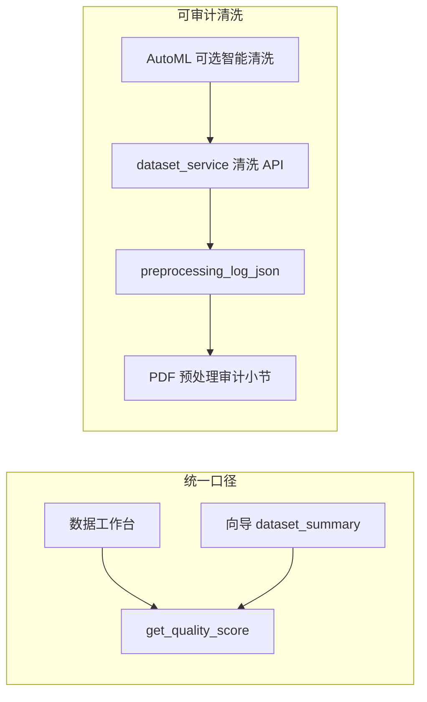

# 统一数据质量分与 AutoML 智能清洗

> **版本对应**：v0.5.x  
> **最后更新**：2026-04-07  
> **对应代码**：`server/services/dataset_service.py`（`get_quality_score`）、`server/services/wizard_service.py`（`dataset_summary`）、`server/services/automl_preprocess_service.py`（`plan_and_apply_smart_clean`）、`server/services/dataset_narrative_service.py`（预处理审计）、`server/services/report_service.py`（PDF 数据关系章节）

---

## 白皮书摘要（对外可节选）

XGBoost Studio 将**数据质量综合分（0–100）**在**数据工作台**与**智能向导**之间定义为**同一套算法**，避免因入口不同产生不可比分数。质量分由全表缺失率、数值特征行级 3σ 异常率、重复行率加权构成，并给出可操作的改进建议字符串。

可选的 **AutoML 智能清洗**（实现见 `automl_preprocess_service`）在**复用既有清洗 API** 的前提下，按固定顺序执行去重、按列填充缺失、必要时对数值异常做 IQR 截断；每次操作写入数据集 **`preprocessing_log_json`**，与专业 PDF 报告中的「用户预处理与清洗操作记录」同源，满足**可追溯、可审计**要求。服务端 **XGBoost 训练管线的默认缺失/标签处理**与用户侧清洗**相互独立**，报告中分节说明以免混淆。

**局限性**：质量分与异常检测均为启发式，不替代领域专家审查；智能清洗默认不自动删除高缺失列，以免误伤 ID 类字段。AutoML 编排层对智能清洗的 **API 开关与结果字段**若与本文描述不一致，以 OpenAPI 与当前代码为准。

---

## 一、背景与目标

### 1.1 曾存在的问题

- **口径分裂**：若向导侧仅用「缺失单元格比例」近似质量分，而工作台调用完整的 `get_quality_score`（含异常与重复），则同一数据集在不同界面可能出现分数不一致。
- **AutoML 路径**：在仅做划分与训练、未复用工作台清洗 API 的情况下，既难以自动改善数据可读性，也难以在报告里留下与界面操作同结构的审计记录。

### 1.2 目标状态

- **向导摘要**与 **`GET /api/datasets/{id}/quality-score`** 使用同一套 `get_quality_score` 结果（分数与三率、建议列表）。
- **智能清洗**（启用时）复用 `handle_missing`、`drop_duplicates`、`handle_outliers_by_strategy` 等，并写入 `preprocessing_log_json`。
- **PDF**：在「数据与变量关系」章节展示预处理审计条目，并在固定小节中陈述质量口径（见 [07-pdf-report.md](07-pdf-report.md)）。

---

## 二、质量综合分定义

实现：`server/services/dataset_service.py` → `get_quality_score(dataset)`。

| 指标 | 含义 | 参与扣分 |
|------|------|----------|
| **missing_rate** | 全表单元格缺失比例（`isna().mean().mean()`） | 每 1% 缺失扣 0.4 分（系数 40） |
| **outlier_rate** | 对数值列计算 Z 分数，**任一数值列** \|Z\|>3 则该行记为异常；异常行比例 | 每 1% 扣 0.3 分（系数 30） |
| **duplicate_rate** | 完全重复行比例 | 每 1% 扣 0.3 分（系数 30） |

分数从 100 起减，**裁剪到 [0, 100]**，保留一位小数。`suggestions` 在缺失率 >5%、异常率 >5%、重复率 >1% 等条件下给出中文提示，与工作台展示一致。

**API 与向导字段**：向导 `dataset_summary` 返回 `quality_score`、`missing_rate`、`outlier_rate`、`duplicate_rate`、`quality_suggestions`（与质量 API 的 `suggestions` 同源列表）。

---

## 三、智能清洗（AutoML 前置）

实现模块：`server/services/automl_preprocess_service.py` → `plan_and_apply_smart_clean(dataset, db)`。

### 3.1 执行顺序

1. **去重**：若 `duplicate_rate > 0.01`，调用 `drop_duplicates`；否则记录未执行原因。
2. **缺失**：对存在缺失的列构造 `handle_missing` 配置——数值列 `median`，非数值列 `mode`；缺失率过高时仅在返回的 `warnings` 中提示，**首版不自动删列**。
3. **异常**：清洗后重新计算质量分；若 `outlier_rate > 0.05`，对数值列执行 `handle_outliers_by_strategy(..., strategy="clip")`（IQR 截断语义以 `dataset_service` 实现为准）。

### 3.2 审计日志

清洗结束后追加一条预处理日志，`kind` 为 **`automl_smart_clean`**，`detail` 内含 `quality_before`、`quality_after`、`steps`、`warnings`。该 JSON 由 `dataset_narrative_service._load_preprocessing_audit` 解析，进入 PDF「用户预处理与清洗操作记录」列表。

### 3.3 与 AutoML 编排的衔接

`run_automl_job` 在划分与 `dataset_summary` **之前**调用 `plan_and_apply_smart_clean`（当请求体 `smart_clean` 为 `true`，默认开启）。SSE 含 `smart_clean` / `smart_clean_done`（或 `smart_clean_skip`）步骤。`GET .../result` 的 JSON 含 **`pipeline_plan`**（`smart_clean` 审计摘要、`split`、`tuning`）。CLI / REPL 可用 **`--no-smart-clean`** 关闭清洗以便复现。

### 3.4 划分策略辅助

同文件中的 `resolve_split_strategy` 支持 `auto` / `random` / `time_series` 与时间列解析（含按列名启发式匹配日期时间列），供与 `split_dataset` 对齐使用；是否暴露为 API 字段以实现为准。

---

## 四、界面与 API 对照

| 入口 | 质量分来源 | 清洗与审计 |
|------|------------|------------|
| 数据导入 / 工作台 | `GET /api/datasets/{id}/quality-score` → `get_quality_score` | 用户操作走 `dataset_service` 各接口 → `preprocessing_log_json` |
| 智能向导 Step 0 | `GET /api/wizard/dataset-summary/{id}` → 内部 `get_quality_score` | 同左（若使用 AutoML 智能清洗则见 §3） |
| AutoML / CLI | 摘要步骤使用 `wizard_service.dataset_summary`（质量同源） | 智能清洗见 §3.3 |

---

## 五、PDF 报告中的体现

- **固定说明**：在含「数据与变量关系」的模板中，报告在「用户预处理与清洗操作记录」前增加**数据质量口径与可审计性**短文（规则生成，非大模型），与「训练阶段默认处理说明」区分职责。
- **明细列表**：`preprocessing_audit` 来自数据集 `preprocessing_log_json`；单条 `detail` 过长时在 PDF 内截断（与 `report_service` 实现一致，约 1600 字符）。
- **AutoML 策略摘要**：`pipeline_plan` 随任务结果返回（前端与 CLI 可展示）；PDF 仍以 `preprocessing_log_json` 中的分步记录与 **`automl_smart_clean`** 汇总条目为主；若需将整段 `pipeline_plan` 写入 PDF 固定段落，可后续持久化到模型元数据再扩展叙事。

详见 [07-pdf-report.md §四](07-pdf-report.md#四报告内容自动生成逻辑) 与 [07-pdf-report.md §八](07-pdf-report.md#八报告解读指南)。

---

## 六、刻意未纳入的范围

以下**不属于**当前文档所描述的首版交付，避免范围蔓延：

- 与工作台完全同构的「质量报告弹窗」嵌入向导（仅用统一分数 + 三率亦可对齐口径）。
- 复杂缺失机制（MCAR/MAR）推断、多时间列 UI。
- 自动删特征、SMOTE 等超出当前 `dataset_service` 已有 API 的能力。

---

## 七、相关文档

- AutoML 能力边界与 API：[08-automl-wizard.md](08-automl-wizard.md)  
- 数据分析与目标列推荐：[03-data-analysis.md](03-data-analysis.md)  
- PDF 章节与数据来源：[07-pdf-report.md](07-pdf-report.md)  
- 命令行工具：[../guides/xs-studio-cli.md](../guides/xs-studio-cli.md)

---

## 版本历史

| 日期 | 摘要 |
|------|------|
| 2026-04-07 | v0.5.0：文首「版本对应」与产品 v0.5.x 对齐（能力同初版）。 |
| 2026-04-07 | 初版：统一质量分、智能清洗模块、审计与 PDF 呈现说明；白皮书摘要内嵌 |
